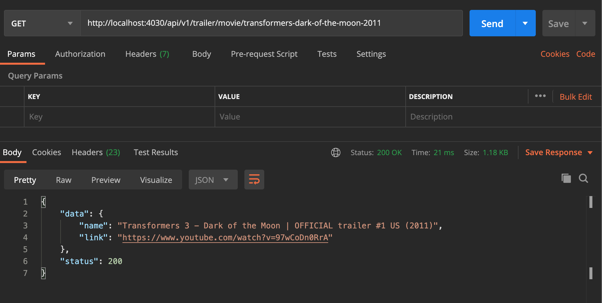

<!-- PROJECT LOGO -->
<br />
<p align="center">
  <h3 align="center">ViaPlay - Movie's trailer Finder API</h3>

  <p align="center">
    A simple Restful API written in Node.js, Express.
    <br />
</p>


<!-- TABLE OF CONTENTS -->
## Table of Contents

* [About the Project](#about-the-project)
  * [Built With](#built-with)
* [Getting Started](#getting-started)
  * [Prerequisites](#prerequisites)
  * [Installation](#installation)
* [Usage](#usage) 
* [Endpoints](#endpoints)


## About The Project



This is a **Node.js**, **Express.js** Backend project which provides you a video trailer link of your requested movie. Here are a few things that worth to be mentioned. First of all, For the sake of scalability, I containerized the service and also used **CLUSTER_MODE** (which is switchable in the `.env` file and also, added a **caching layer** on top of all my APIs.


### Built With
I decided to go with a few libraries which I believe are very beneficial/powerful in working on something that gonna be highly accessible, scalable, and maintainable.
* **Node.js**
* **Express.js**
* **Typescript**
* **RxJs**
* **Swagger**
* Jest
* tslint
* Prometheus
* CSRF
* Request
* response-time


<!-- GETTING STARTED -->
## Getting Started

This is an example of how you may give instructions on setting up your project locally.
To get a local copy up and running follow these simple example steps.

### Prerequisites

If you're going to use the docker version to run the project make sure that you have **Docker** installed on your local machine. Or if you're going to just run it using **Node** make sure that you installed **Node and NPM** on your machine.

* npm
```sh
npm install npm@latest -g
```

### Installation/Running

1. Clone the repo
```sh
git clone https://github.com/MortezaAghili/via-movie.git
```
2. Install NPM packages
```sh
npm install
```
3. Change the `CLUSTER_MODE` if you wanna check the workers and load balancer. It will create workers based on your actual `CPUs' cores`:
```JS
CLUSTER_MODE=true
```
4. Run in Dev mode:
```sh
npm run dev
```
5. Run the tests:
```sh
npm run test
```

### Running the container
```sh
docker-compose up
```


## Usage

Either you decided to go with or without **Docker** now you're ready to test the API. You can navigate to http://localhost:4030/swagger and check the documentation and try a film title like **transformers-dark-of-the-moon-2011** live.

Notice that I have added a **caching layer** to make the API faster. The default cache expires time set as a **CACHE_DURATION** in the `.env` file.  
* Notice in the real world scenario, I definitely, use `Kubernetes`, `Helm` to make the service serverless and host it on `AWS`.


## Endpoints
Here you can find all the endpoints that we have in this project:
| Endpoint | Desciription|
| :---: | :---: |
| `/api/v1/trailer/movie/{movie-title}` | Get movie's trailer |
| `/metrics` | Service metrics by Prometheus |
| `/healthcheck` | Check service health |

